# Lapin-Atallier

<html lang="es">
<head>
    <meta charset="UTF-8" />
    <meta name="viewport" content="width=device-width, initial-scale=1.0" />
    <title>Lapin Atelier</title>

    
</head>

<body>

<header>
    <h1>Lapin Atelier</h1>
    
    <nav>
        <a href="#proyectos">Proyectos</a>
        <a href="#galeria">Galería</a>
        <a href="#equipo">Equipo</a>
        <a href="#agenda">Agenda</a>
        <a href="#talleres">Talleres</a>
        <a href="#contacto">Contacto</a>
    </nav>
</header>

    <h1>Introducción</h1>
    

        DEDICA es una empresa creada para brindar a jóvenes y personas de todas las edades
        un espacio donde puedan expresarse artísticamente a través de la creación de figuras
        de arcilla y pinturas. Ofrecemos gratuitamente materiales y herramientas para que
        cada participante pueda desarrollar sus obras y dar valor a su talento.
    

<section id="proyectos">
    <h2>Proyectos</h2>
    <h3>Talleres de Pintura</h3>
    <h3>Talleres de Cerámica</h3>
    <h3>Talleres de Grabado</h3>
</section>

<section id="agenda">
    <h2>Agenda</h2>

    <h3>🎨 Área de Pintura</h3>
    <ul>
        <li><strong>09:00 – 10:30</strong> | Pintura básica</li>
        <li><strong>10:45 – 12:15</strong> | Pintura acrílica</li>
        <li><strong>12:30 – 14:00</strong> | Pintura experimental</li>
    </ul>

    <h3>🖨️ Área de Grabado</h3>
    <ul>
        <li><strong>09:00 – 10:30</strong> | Introducción al grabado</li>
        <li><strong>10:45 – 12:15</strong> | Grabado en linóleo</li>
        <li><strong>12:30 – 14:00</strong> | Técnicas mixtas</li>
    </ul>

    <h3>🏺 Área de Cerámica</h3>
    <ul>
        <li><strong>09:00 – 10:30</strong> | Modelado básico</li>
        <li><strong>10:45 – 12:15</strong> | Torno cerámico</li>
        <li><strong>12:30 – 14:00</strong> | Esmaltado</li>
    </ul>
</section>

<section id="galeria">
    <h2>Galería</h2>
    

        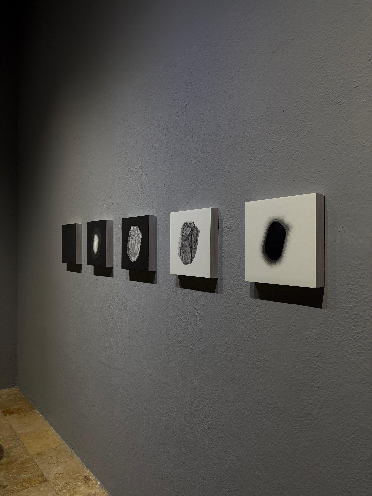
        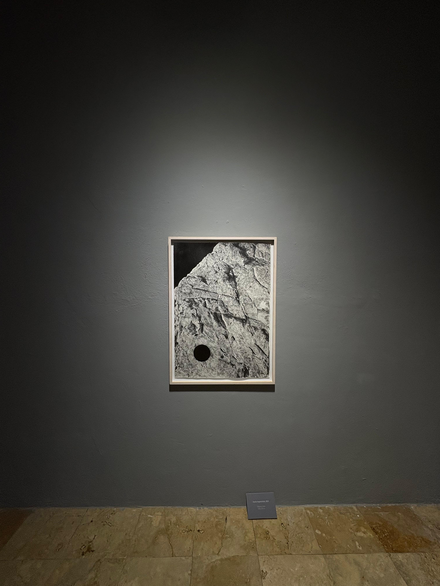
        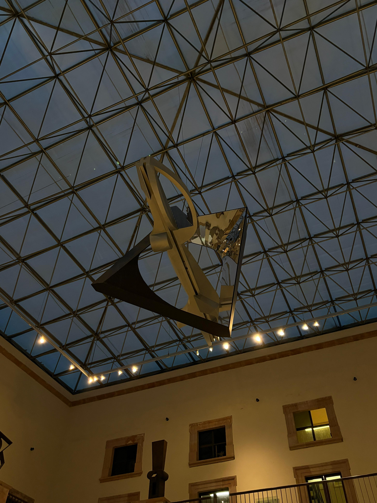
        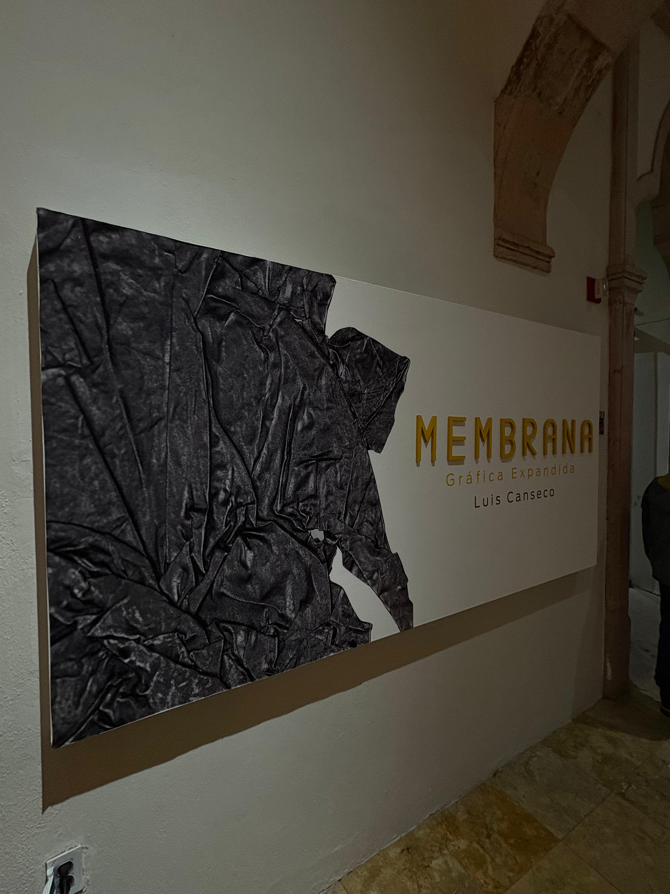
        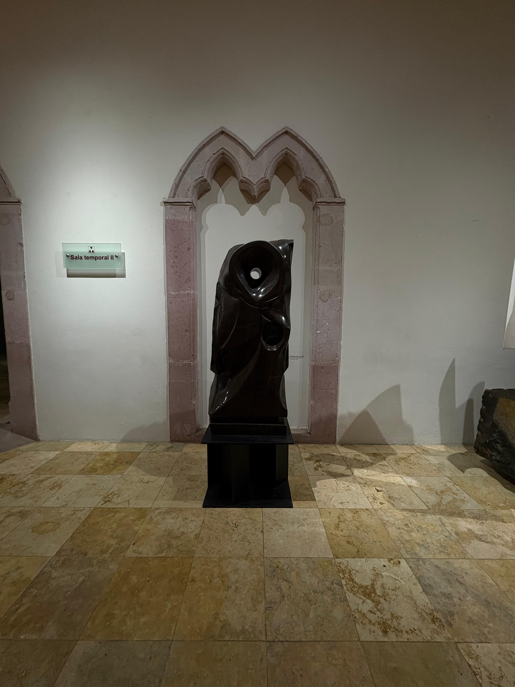
        
        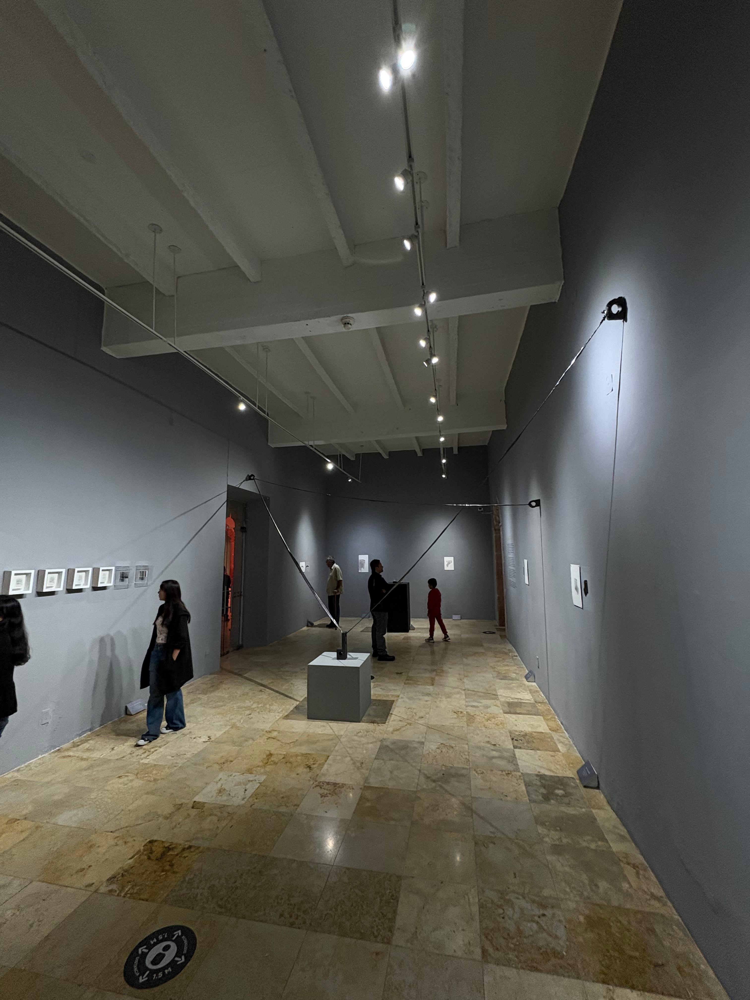
        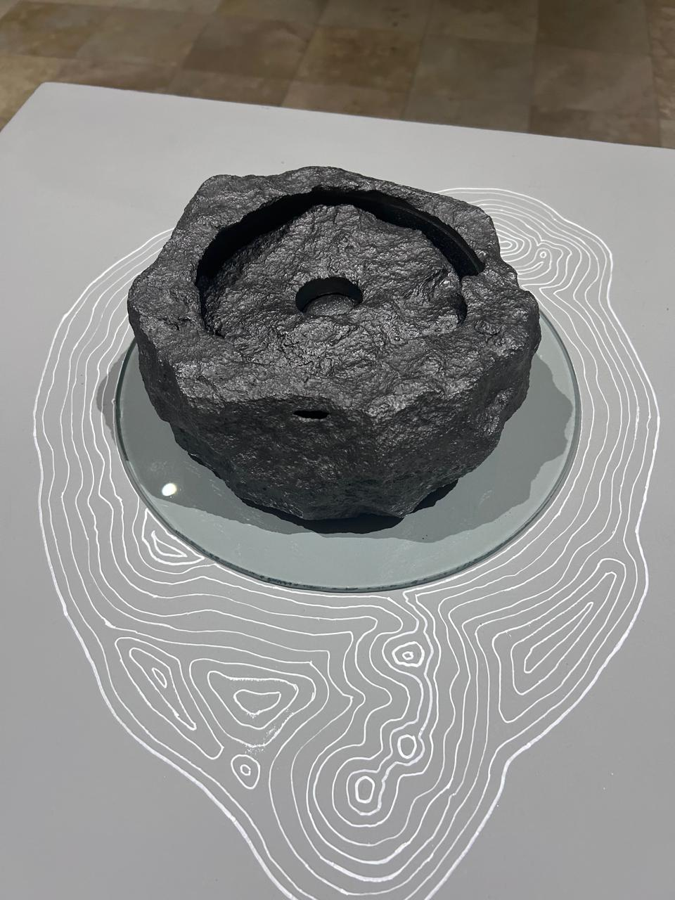
    

</section>

<section id="talleres">
    <h2>Talleres</h2>
    

        

            <h3>Grabado</h3>
            
Aprende técnicas de impresión artística.

            
        

        

            <h3>Cerámica</h3>
            
Creación de piezas con arcilla.

            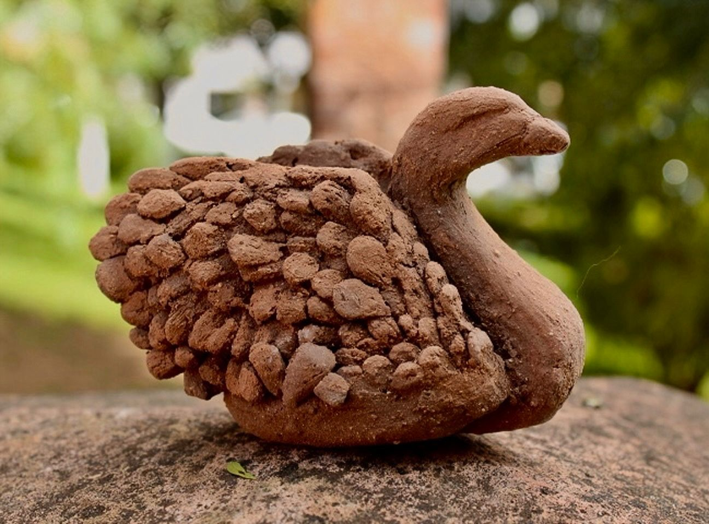
        

        

            <h3>Pintura</h3>
            
Técnicas con acrílicos y acuarelas.

            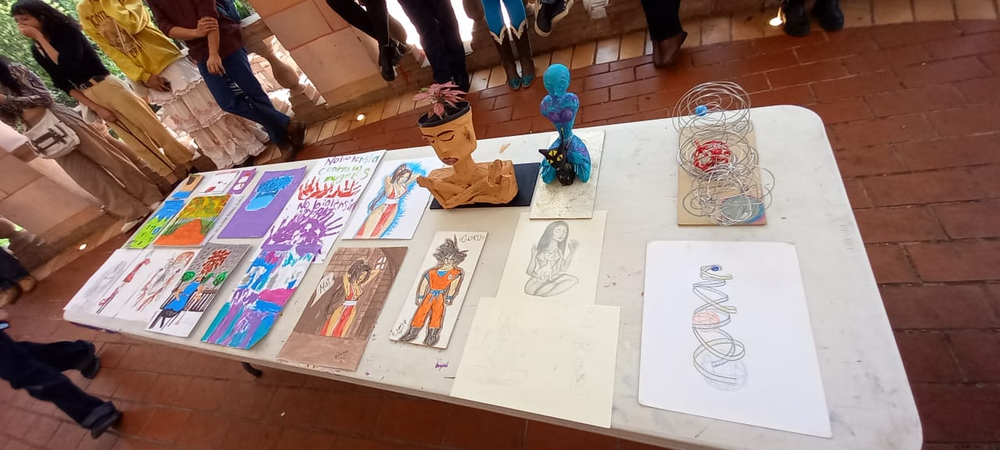
        

        

            <h3>Escultura</h3>
            
Trabajo tridimensional artístico.

            
        

        

            <h3>Pintura</h3>
            
Exploración creativa.

            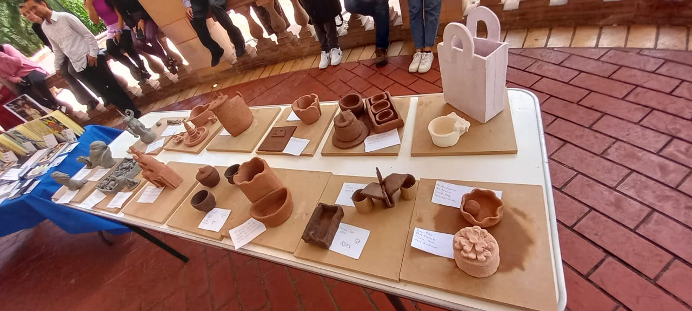
        

    

</section>

<section id="equipo">
    <h2>Nuestro Equipo</h2>
    

        

            
            <h3>Manuel Haro</h3>
            
Director

        

        

            
            <h3>Osvaldo</h3>
            
Artista

        

        

            
            <h3>Elvia</h3>
            
Artista

        

        

            
            <h3>Mauricio</h3>
            
Artista

        

    

</section>

<section id="contacto">
    <h2>Contacto</h2>
    

        <a href="mailto:topobikerzac@hotmail.com">
             Correo
        </a>
        <a href="tel:4921252430">
             Teléfono
        </a>
        <a href="https://www.tiktok.com/@dedica.fundation" target="_blank">
             TikTok
        </a>
        <a href="https://www.instagram.com/lapinatelier22/" target="_blank">
            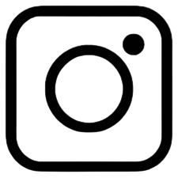 Instagram
        </a>
        <a href="https://www.facebook.com/colectivolapinatelier1/" target="_blank">
             Facebook
        </a>
    

</section>

<footer>
    &copy; Fundación Dedica
</footer>

</body>
</html>
