# Lapin-Atallier<!DOCTYPE html>
<html lang="es">
<head>
    <meta charset="UTF-8" />
    <meta name="viewport" content="width=device-width, initial-scale=1.0" />
    <title>Lapin Atelier | Arte y Creación</title>
    
</head>
<body>

<header>
    

        <h1>Lapin Atelier</h1>
        
        <nav>
            <a href="#proyectos">Proyectos</a>
            <a href="#galeria">Galería</a>
            <a href="#agenda">Agenda</a>
            <a href="#talleres">Talleres</a>
            <a href="#equipo">Equipo</a>
            <a href="#contacto">Contacto</a>
        </nav>
    

</header>

    <h1>Lapin Atelier</h1>
    

        DEDICA es un espacio creativo donde jóvenes y personas de todas las edades 
        pueden expresarse libremente a través del arte. Ofrecemos talleres gratuitos 
        de pintura, cerámica, grabado y escultura, con todos los materiales incluidos.
    

<section id="proyectos">
    <h2>Nuestros Proyectos</h2>
    <h3 style="text-align:center; margin: 30px 0 40px; color:#e67e22;">Talleres de Pintura • Cerámica • Grabado • Escultura</h3>
</section>

<section id="agenda">
    <h2>Agenda Semanal</h2>
    

        

            <h3>🎨 Área de Pintura</h3>
            <ul style="margin-top:15px; line-height:2.1;">
                <li><strong>09:00 – 10:30</strong> | Pintura básica</li>
                <li><strong>10:45 – 12:15</strong> | Pintura acrílica</li>
                <li><strong>12:30 – 14:00</strong> | Pintura experimental</li>
            </ul>
        

        

            <h3>🖌️ Área de Grabado</h3>
            <ul style="margin-top:15px; line-height:2.1;">
                <li><strong>09:00 – 10:30</strong> | Introducción al grabado</li>
                <li><strong>10:45 – 12:15</strong> | Grabado en linóleo</li>
                <li><strong>12:30 – 14:00</strong> | Técnicas mixtas</li>
            </ul>
        

        

            <h3>🏺 Área de Cerámica</h3>
            <ul style="margin-top:15px; line-height:2.1;">
                <li><strong>09:00 – 10:30</strong> | Modelado básico</li>
                <li><strong>10:45 – 12:15</strong> | Torno cerámico</li>
                <li><strong>12:30 – 14:00</strong> | Esmaltado y terminados</li>
            </ul>
        

    

</section>

<section id="galeria">
    <h2>Galería de Obras</h2>
    

        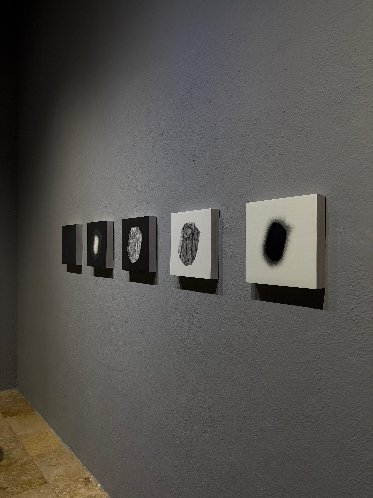
        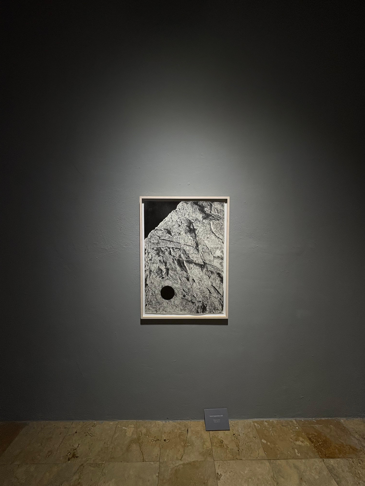
        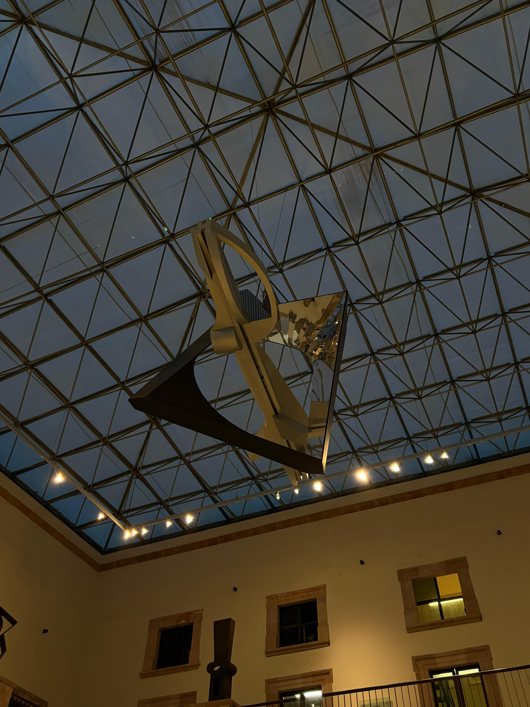
        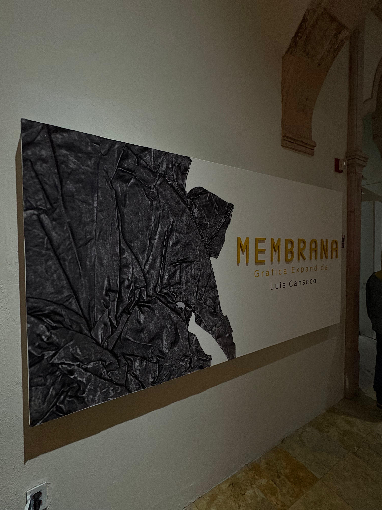
        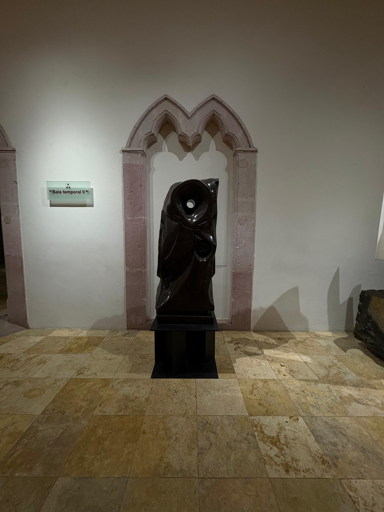
        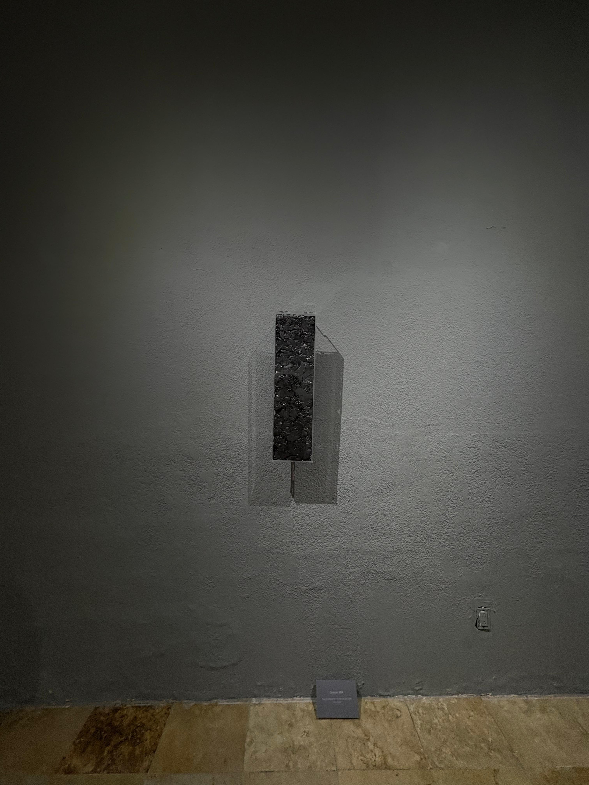
        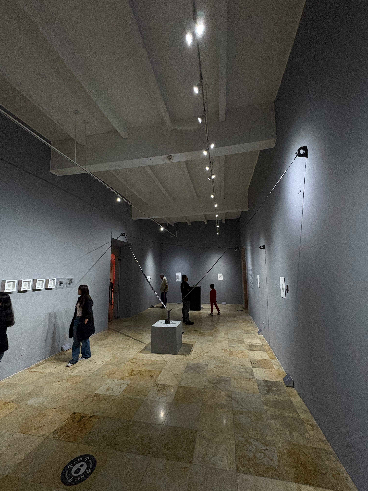
        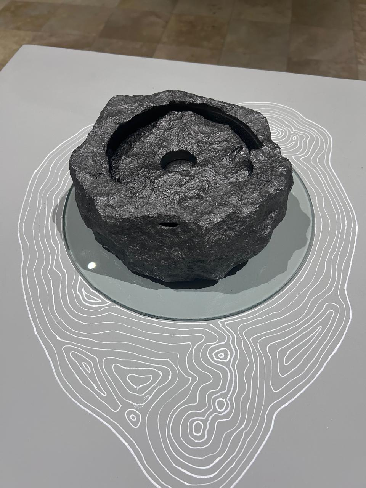
    

</section>

<section id="talleres">
    <h2>Nuestros Talleres</h2>
    

        

            
            

                <h3>Grabado</h3>
                
Aprende técnicas tradicionales y contemporáneas de impresión artística.

            

        

        

            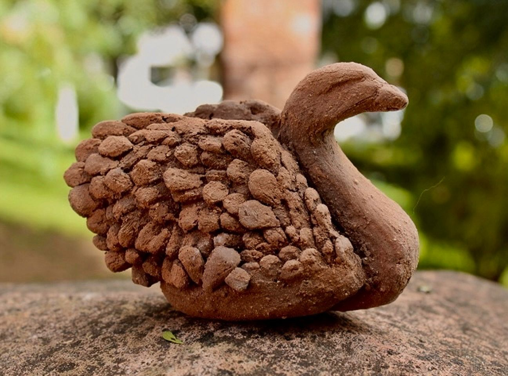
            

                <h3>Cerámica</h3>
                
Modelado, torno y esmaltado de piezas únicas en arcilla.

            

        

        

            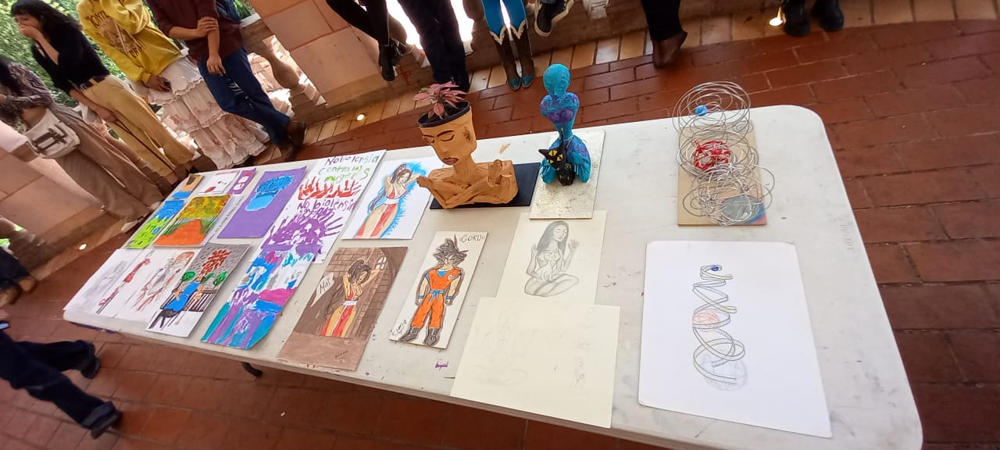
            

                <h3>Pintura</h3>
                
Técnicas con acrílico, óleo y acuarela para todos los niveles.

            

        

        

            
            

                <h3>Escultura</h3>
                
Creación de obras tridimensionales con diferentes materiales.

            

        

    

</section>

<section id="equipo">
    <h2>Nuestro Equipo</h2>
    

        

            
            <h3>Manuel Haro</h3>
            
Director y Fundador

        

        

            
            <h3>Osvaldo Ramírez</h3>
            
Artista y Tallerista

        

        

            
            <h3>Elvia González</h3>
            
Artista Visual

        

        

            
            <h3>Mauricio López</h3>
            
Especialista en Cerámica

        

    

</section>

<section id="contacto">
    <h2>Contáctanos</h2>
    

        <a href="mailto:topobikerzac@hotmail.com">
             topobikerzac@hotmail.com
        </a>
        <a href="tel:4921252430">
             (492) 125 2430
        </a>
        <a href="https://www.tiktok.com/@dedica.fundation" target="_blank">
             @dedica.fundation
        </a>
        <a href="https://www.instagram.com/lapinatelier22/" target="_blank">
            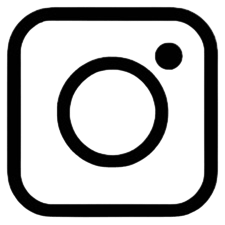 @lapinatelier22
        </a>
        <a href="https://www.facebook.com/colectivolapinatelier1/" target="_blank">
             Colectivo Lapin Atelier
        </a>
    

</section>

<footer>
    
&copy; 2026 Fundación DEDICA • Lapin Atelier

    
Espacio creativo abierto para toda la comunidad

</footer>

</body>
</html>
